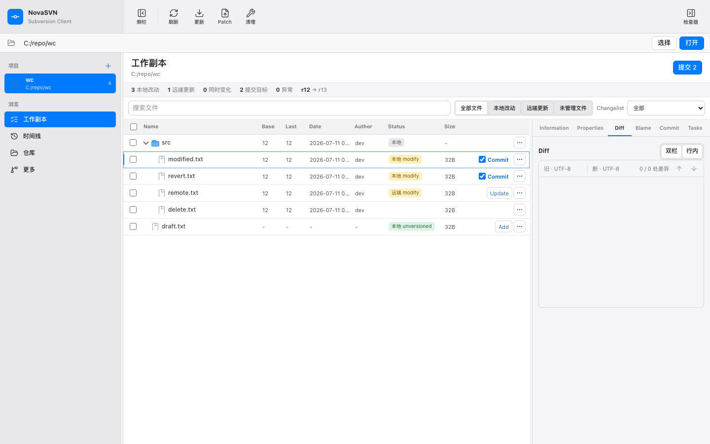
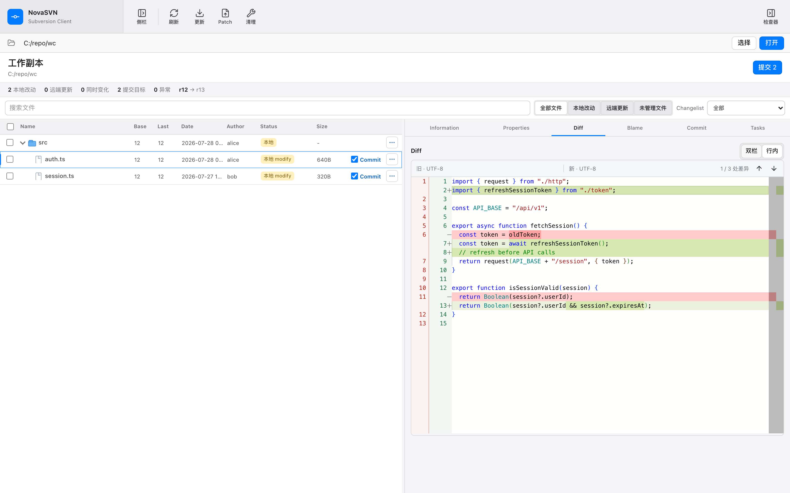

# NovaSVN

English | [简体中文](README.zh-CN.md)

[](https://github.com/wuchunpeng777/NovaSVN/actions/workflows/ci.yml)
[](LICENSE)
[](package.json)

**NovaSVN** is an open-source desktop Subversion client for **Windows** and **macOS**.

<p align="center">
  
</p>

<p align="center">
  
</p>

It is a full workbench for day-to-day SVN work — not a pile of one-off dialogs. Browse local changes, review history, open the repository, merge with a preview, apply patches, and still launch focused windows from the system shell when that is faster.

**On macOS, this gap is especially clear:** the platform has long lacked a polished, actively maintained desktop SVN client with a modern workbench. Teams often end up juggling the command line, half-finished GUIs, or remote Windows-only workflows. NovaSVN is built so macOS users get a first-class client — not a second-class port.

Under the hood it drives the real `svn` CLI you already configure and trust, instead of reimplementing the protocol stack.

> **Status:** `0.3.0` is a **development preview**. NovaSVN runs real SVN commands against local working copies and remote repositories. Always review paths, revisions, and pending changes before destructive operations.

---

## What makes NovaSVN different

Most mature SVN tools grew up as **shell extensions** or **single-purpose dialogs**: right-click a folder, fill a form, close the window. That workflow is reliable for quick ops, but it rarely gives you a place to *live* while reviewing a working copy.

NovaSVN takes a different approach:

| Focus | What you get |
| --- | --- |
| **Workbench first** | One main window for status, multi-select, tree navigation, bulk commit / revert / move / delete — closer to a modern IDE workspace than to a stack of modal dialogs |
| **Shell when you want it** | Still open Log, Commit, Update, Checkout, Repo Browser, and more from Explorer / Finder; use the full app when the job needs context |
| **macOS as a first-class platform** | Not an afterthought: same workbench and shell integration path on Mac, where usable desktop SVN software has been scarce for years |
| **Cross-platform by design** | Same product direction on **Windows and macOS** — keep one client and one workflow across the team |
| **Review-oriented UI** | Monaco-powered text Diff, encoding-aware comparison, image Diff, Blame, revision log with WC highlight, one-click copy of a revision number |
| **Preview before risk** | Merge dry-run and a dedicated merge-preview window so you can inspect the plan before writing the working copy |
| **Real `svn`, not a clone** | Official Subversion CLI for auth, servers, and edge cases you already rely on — NovaSVN orchestrates, it does not replace the toolchain |
| **Lightweight & open** | Tauri + Rust + Svelte, MIT licensed — inspect, fork, and contribute |

**In short:** keep the reliability of the official `svn` tool, add a modern multi-surface desktop app, and avoid treating every task as “open a dialog, close a dialog.” On Mac in particular, it aims to be the desktop SVN client that was simply missing.

If you still maintain SVN repositories — especially on macOS, or across mixed Windows/Mac teams — and want a UI that feels current without inventing a new VCS, NovaSVN is built for that middle ground.

---

## Features

### Working copy workbench

- Scan local and remote changes in a compact file table (status, revision, author, size, …)
- Multi-select and tree navigation; bulk commit / revert / move / delete
- Partial commit of selected paths without a Git-style staging area
- Diff (text, encoding-aware, image), Blame, Properties, and changelists
- Light / dark / system themes

### History & timeline

- Load, filter, and paginate repository logs
- Highlight the current working-copy revision in the timeline
- Diff changed paths, compare revisions, reverse / revert selected revisions
- Export a path at a given revision (no `.svn` metadata)
- Copy a single revision number for pasting into commands or forms

### Repository browser

- Browse HEAD or a historical revision
- Log, Blame, Properties, Checkout, Export, Import, Mkdir, Copy, Move, Rename, Delete
- Drag entries out to the file manager after a real export

### Merge, patch & conflicts

- Configurable merge with cancelable dry-run and a standalone preview window
- Generate / apply patches
- Text conflict resolution helpers

### Desktop integration

Use the full workbench, or launch focused windows from the shell:

| Surface | Examples |
| --- | --- |
| Main app | Status workbench, multi-file review, repository browsing |
| Standalone windows | Log, Update, Commit, Revert, Clean Up, Checkout, Repo Browser, Blame, Info, conflict tools |
| System entry points | Windows Explorer context menus (installer-registered); macOS Finder Quick Actions / Finder Sync |
| CLI-style launch | e.g. `--novasvn-action browse` |

---

## Requirements

### To run

| Requirement | Notes |
| --- | --- |
| OS | Windows 10+ or recent macOS |
| Subversion CLI | `svn` on `PATH`, or set the executable path in NovaSVN settings |
| Access | Credentials / certificate trust as required by your repositories |

### To build from source

| Requirement | Notes |
| --- | --- |
| [Node.js](https://nodejs.org/) | 24 recommended (matches CI) |
| [Rust](https://rustup.rs/) | Stable toolchain + Cargo |
| [Tauri 2](https://v2.tauri.app/start/prerequisites/) | Platform system dependencies |
| Subversion CLI | Needed for integration tests and local SVN workflows |

---

## Install

### Prebuilt packages

Build artifacts locally (see [Packaging](#packaging)), or use GitHub [Releases](https://github.com/wuchunpeng777/NovaSVN/releases) when published.

Typical outputs after a release build:

| Platform | Artifact |
| --- | --- |
| Windows | `src-tauri/target/release/bundle/nsis/NovaSVN_*_x64-setup.exe` |
| macOS | `src-tauri/target/release/bundle/dmg/*.dmg` |

### From source (development)

```bash
git clone https://github.com/wuchunpeng777/NovaSVN.git
cd NovaSVN
npm ci
npm run tauri:dev
```

Frontend-only browser preview (no native FS / SVN / shell integration):

```bash
npm run dev
```

---

## Development

### Useful scripts

| Command | Purpose |
| --- | --- |
| `npm run tauri:dev` | Full desktop app in dev mode |
| `npm run dev` | Frontend only (Vite) |
| `npm run build` | Typecheck + production frontend build |
| `npm run check` | Same combined quality gate as CI |
| `npm run test:components` | Vitest (Svelte / TS) |
| `npm run test:rust` | Rust unit tests |
| `npm run lint:rust` | Clippy (`-D warnings`) |
| `npm run test:e2e` | Playwright end-to-end |
| `npm run test:scripts` | Package / release script self-tests |

### Real SVN workflow tests

These create temporary local repositories (Windows PowerShell scripts):

```powershell
npm run test:svn
npm run test:svn:partial
```

### Project layout

```text
src/                 Svelte + TypeScript UI
src-tauri/           Rust backend, Tauri config, shell extensions
  windows-shell-extension/   Windows Explorer integration
  macos-finder-sync/         macOS Finder Sync extension sources
tests/e2e/           Playwright tests
scripts/             Release, SVN workflow, and benchmark helpers
.github/workflows/   CI
```

### Tech stack

- **UI:** Svelte 5, TypeScript, Vite, Monaco Editor
- **Desktop:** Tauri 2
- **Backend:** Rust (`svn` process orchestration, tasks, workspace logic)
- **Tests:** Vitest, Playwright, Cargo tests, PowerShell SVN workflow scripts

---

## Packaging

### Automated release (recommended)

CI builds installers and publishes a [GitHub Release](https://github.com/wuchunpeng777/NovaSVN/releases) when a version tag is pushed.

```bash
# 1) Bump and sync version across package.json / Cargo / tauri / Finder Sync
npm run version:sync -- --set 0.2.0

# 2) Commit the version bump on main
git add -A
git commit -m "chore: release 0.2.0"
git push origin main

# 3) Tag and push — this starts .github/workflows/release.yml
git tag v0.2.0
git push origin v0.2.0
```

The tag **must** match `package.json` (e.g. tag `v0.2.0` ↔ version `0.2.0`).  
Artifacts: Windows NSIS installer + macOS DMG (+ `release-manifest.json` with SHA-256).

You can also run the **Release** workflow manually from the Actions tab (`workflow_dispatch`).

> **Note:** CI macOS builds currently use the local/unsigned packaging path. Notarized distribution still needs Apple Developer credentials (`npm run release:macos:notarized` or future CI secrets).

### Local packaging

#### Windows (NSIS)

```powershell
npm run release:windows
```

Produces an installer under `src-tauri/target/release/bundle/nsis/`.

#### macOS

```bash
# Local DMG
npm run release:macos

# Notarized release (Developer ID + notary profile required)
npm run release:macos:notarized
```

Version strings are kept in sync via:

```bash
npm run version:check
npm run version:sync -- --set 0.2.0
```

---

## Contributing

Contributions are welcome.

1. Fork the repository and create a feature branch from `main`.
2. Keep changes focused; match existing code style and test patterns.
3. Run `npm run check` (and relevant focused tests) before opening a PR.
4. Describe the user-visible behavior and any risk to working copies / remotes.

### Reporting issues

Please include:

- OS and NovaSVN version
- `svn --version`
- What you were doing (steps to reproduce)
- Relevant logs or error text

**Do not paste passwords, tokens, or private repository URLs.** Redact secrets before posting.

---

## Safety notes

- NovaSVN executes **real** `svn` commands (commit, delete, merge, switch, export, …).
- Double-check **target path**, **URL**, and **revision** before confirming.
- Prefer dry-run / preview flows for merge when available.
- Development preview software may still change behavior between releases — check `git log` for recent changes.

---

## License

NovaSVN is released under the [MIT License](LICENSE).

Third-party notices (e.g. Lucide-based Explorer icons) are documented next to the assets that use them.

---

## Links

- [GitHub repository](https://github.com/wuchunpeng777/NovaSVN)
- [CI status](https://github.com/wuchunpeng777/NovaSVN/actions/workflows/ci.yml)
- [Issue tracker](https://github.com/wuchunpeng777/NovaSVN/issues)
- [Commit history](https://github.com/wuchunpeng777/NovaSVN/commits/main)
